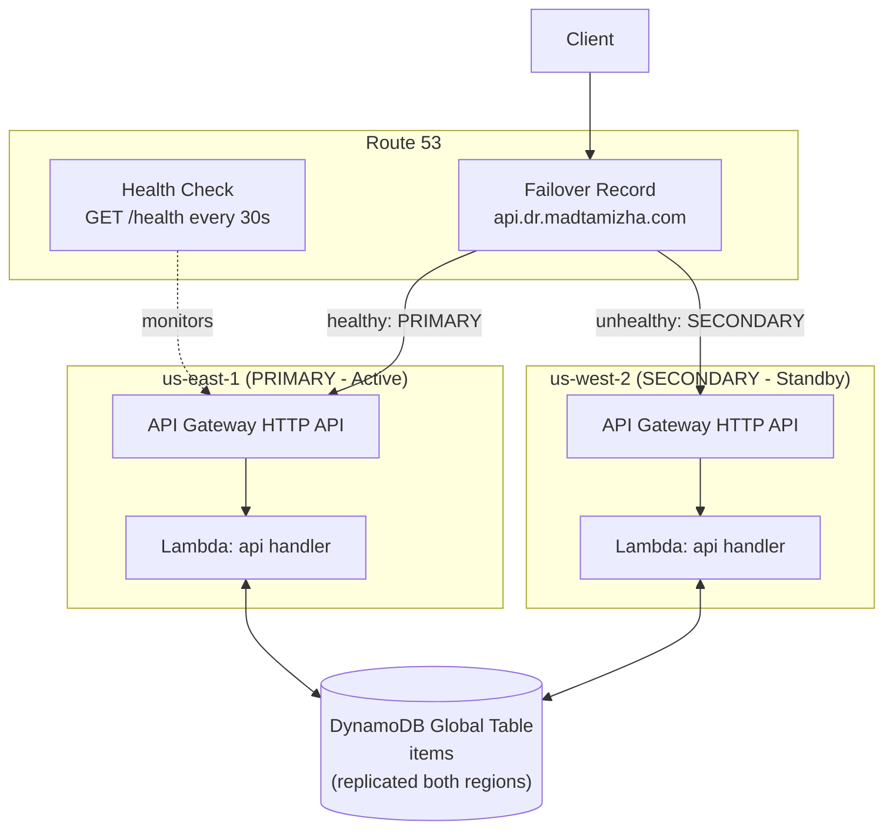

# Multi-Region Active-Passive DR Architecture (AWS)

A fully working, Terraform-provisioned disaster recovery setup demonstrating
**Route 53 failover routing**, **DynamoDB Global Tables**, and a serverless
**Lambda + API Gateway** application deployed identically to two AWS regions.

Live failover endpoint: `api.dr.madtamizha.com`

## Architecture



## Components

| Layer | Service | Notes |
|---|---|---|
| DNS / Failover | Route 53 | Hosted zone `dr.madtamizha.com`, health check on primary `/health`, PRIMARY/SECONDARY CNAME records |
| Compute | Lambda (Python 3.12) | Identical code deployed to both regions via Terraform |
| API | API Gateway HTTP API | Regional endpoint per region |
| Data | DynamoDB Global Table | Single table, multi-region replicas, streams-based replication |
| IaC | Terraform | Two aliased AWS providers (`aws.primary`, `aws.secondary`) |

## RTO / RPO

### RPO (Recovery Point Objective): **~0 seconds (sub-second)**

DynamoDB Global Tables replicate writes to the secondary region asynchronously,
typically in **under 1 second**. Both regions' Lambdas read/write the *same*
logical table. We verified this directly: an item written via the primary
region's API was immediately readable from the secondary region's API.

In a true regional outage, only writes made in the seconds immediately before
the outage (that hadn't yet replicated) could be lost — effectively a
sub-second RPO.

### RTO (Recovery Time Objective): **~2-3 minutes (measured)**

We simulated a full primary-region outage (set Lambda reserved concurrency to
0, causing every invocation — including `/health` — to fail with 503) and
timed the real failover:

| Step | Time |
|---|---|
| Primary starts failing | T+0 |
| First Route 53 checker detects failure | ~T+1 min |
| All 16 global checkers confirm unhealthy, Route 53 flips record to SECONDARY | ~T+2 min |
| `api.dr.madtamizha.com` resolves to secondary region | ~T+2-3 min |

Failback was verified the same way: restoring the primary Lambda, the health
check returned to healthy and DNS automatically reverted to PRIMARY within
~2 minutes.

**RTO breakdown by config knob (tunable trade-offs):**

| Setting | Current value | Effect on RTO if lowered |
|---|---|---|
| Health check interval | 30s | 10s ("fast" checks) cuts detection time ~3x, at extra cost |
| Failure threshold | 3 consecutive failures | Lower threshold (e.g. 1) reacts faster but risks false positives from transient blips |
| DNS record TTL | 60s | Clients/resolvers may cache the old answer for up to this long after Route 53 switches |

A lower RTO is achievable (sub-60s) by reducing the health check interval to
10s and threshold to 1-2, traded against false-positive risk and ~3x health
check cost.

## Cost

Everything here runs at **near-zero cost** at portfolio/demo traffic:

- DynamoDB: pay-per-request, fractions of a cent for low volume
- Lambda: within AWS free tier (1M requests/month)
- API Gateway HTTP API: ~$1 per million requests
- Route 53 hosted zone: $0.50/month
- Route 53 health check: ~$0.50/month

**Total: ~$1/month** even with the project left running indefinitely.

## Design decisions & trade-offs

- **Active-passive, not active-active**: the secondary region is fully
  deployed and "warm" (Lambda code is live, DynamoDB replica is live) but
  receives no traffic under normal operation. This keeps the architecture
  simple (no need for write-conflict resolution logic in the app) while still
  giving a fast RTO, since nothing needs to be provisioned during failover —
  only DNS needs to switch.
- **DynamoDB Global Tables over Aurora Global Database**: Aurora requires
  running database instances 24/7 in both regions, which is real ongoing
  cost even at idle. DynamoDB's pay-per-request model and built-in global
  replication achieve the same DR guarantees (cross-region replicated,
  durable data) at near-zero idle cost — appropriate for a project this size,
  though Aurora may be preferred for existing relational workloads.
- **DNS-based failover (Route 53) over a load balancer**: Route 53 failover
  routing requires no always-on compute (unlike a cross-region Global
  Accelerator or ALB-based approach) and is the standard AWS pattern for
  regional DR.
- **CNAME failover records instead of ALIAS to a custom domain**: avoids
  needing ACM certificates + API Gateway custom domain mappings in both
  regions, which would add complexity without changing the DR mechanics being
  demonstrated.

## Deploying

Requires Terraform >= 1.9, AWS CLI configured, and a domain with DNS you
control (for the NS delegation step).

```bash
terraform init
terraform plan
terraform apply
```

After apply, add the 4 NS records from the `dr_zone_name_servers` output to
your domain registrar for the `dr` subdomain.

## Testing failover yourself

```bash
# Break the primary region
aws lambda put-function-concurrency \
  --function-name dr-demo-api-primary \
  --reserved-concurrent-executions 0 --region us-east-1

# Watch Route 53 health check flip to unhealthy, then DNS resolve to secondary
nslookup -type=CNAME api.dr.madtamizha.com <ns-server-from-output>

# Restore primary
aws lambda delete-function-concurrency \
  --function-name dr-demo-api-primary --region us-east-1
```

## Possible extensions

- Custom domain + ACM certs in both regions for full HTTPS on the failover
  endpoint via ALIAS records
- CloudFront + S3 static frontend, also failover-routed
- Remote Terraform state (S3 backend + DynamoDB lock table)
- CI/CD pipeline (GitHub Actions) for `terraform plan`/`apply` on push
- Synthetic canary (CloudWatch Synthetics) instead of simple HTTP health check
